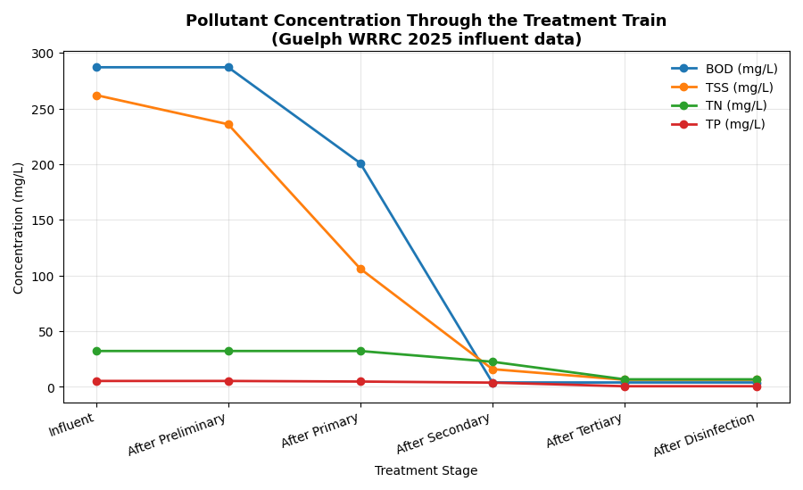
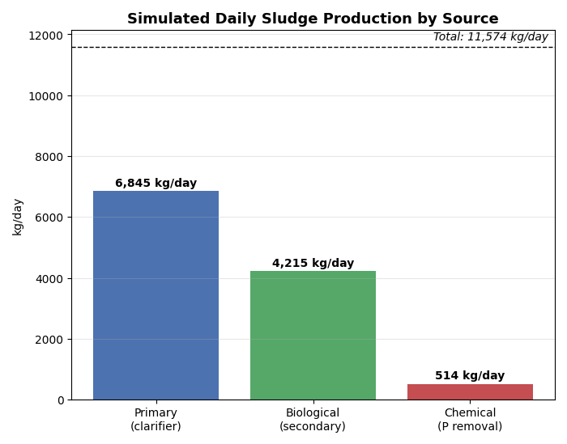

## Municipal Wastewater Treatment & Water Reuse System Simulator

A Python-based simulation of a municipal wastewater treatment train that models preliminary treatment, primary clarification, activated sludge (secondary treatment), tertiary polishing, and chlorination-based disinfection using established wastewater engineering design equations and mass balances.

The model tracks water quality (BOD, TSS, TP, TN, and E. coli) through each treatment stage, estimates sludge production and oxygen demand, and evaluates the final effluent against U.S. EPA irrigation water reuse guidelines.

I built this as a way of trying to incorporate what I learned in my Environmental Engineering Systems class into a real world application instead of just theory.  I wanted to incorporate engineering equations including Monod kinetics for activated sludge, mass-balance sludge production, hydraulic retention time (HRT), food-to-microorganism (F/M) ratio, oxygen demand, Henry's Law for dissolved oxygen saturation, and first-order chlorination kinetics, and then  validate the model against published operating data from a real municipal treatment plant.

## What it models

| Treatment Stage | Engineering Approach |
|-----------------|----------------------|
| Preliminary treatment | Screening and grit removal using representative TSS removal |
| Primary clarification | BOD, TSS, and TP removal with primary sludge mass balance |
| Secondary treatment | Activated sludge modeled using Monod kinetics (CSTR), biomass yield, oxygen demand, HRT, and F/M ratio |
| Tertiary treatment | Filtration and nutrient polishing using representative removal efficiencies |
| Disinfection | First-order chlorine inactivation of *E. coli* based on hydraulic contact time |
| Sludge production | Combined primary, biological, and chemical sludge estimate |

## Validation

The model uses 2025 influent characteristics and average daily flow published by the Guelph Water Resource Recovery Centre (52,783 m³/day).

Where available, plant design parameters were taken directly from the City of Guelph's *Wastewater Treatment and Biosolids Management Master Plan*, including:

- Aeration tank volume: **26,277 m³**
- Estimated chlorine contact tank volume: **~1,300 m³**

The model predicts:

- BOD removal: **98.6%**
- TSS removal: **97.6%**
- TN removal: **79.0%**
- TP removal: **89.2%**
- Total sludge production: **11,574 kg/day**

Predicted sludge production is approximately **85%** of the plant's reported 2025 value (13,684 kg/day), providing a reasonable engineering validation for a simplified treatment model.

## Output

A complete example of the simulator's terminal output is available in
[`outputs_results.txt`](outputs_results.txt).

The report includes:

- Pollutant concentrations at each treatment stage
- Design parameters (HRT, F/M ratio, oxygen demand)
- Sludge production estimates
- Final effluent compliance check
- Overall removal efficiencies

### Figure 1. Pollutant concentration through the treatment train

### Figure 2. Simulated daily sludge production

## Engineering calculations

The simulator computes:

- Hydraulic Retention Time (HRT)
- Food-to-Microorganism (F/M) ratio
- Biological oxygen demand (BOD) using Monod kinetics
- Oxygen demand
- Primary, biological, and chemical sludge production
- Overall pollutant removal efficiencies
- Compliance with EPA irrigation reuse guidelines

## Limitations

This model is intended as an engineering simulation project and includes several simplifying assumptions:

- Secondary treatment is represented as a single completely mixed activated sludge reactor (CSTR).
- TN and TP removal after secondary treatment use representative removal efficiencies rather than full biological nutrient removal kinetics.
- Clarifier performance is modeled using representative removal percentages.
- The disinfection model assumes first-order chlorine decay with literature-based kinetics rather than plant-specific calibration.
- Flow is assumed constant (average daily flow); storm events and diurnal variation are not modeled.

## Tech Stack
- Python 
- matplotlib
- Environmental engineering process modeling
- Mass balance analysis

## Sources

- **City of Guelph**, *Wastewater Services Annual Performance Report*, 2023 & 2025 reporting periods — flow, influent loading, sludge production, and effluent compliance data, including confirmation that the real plant consistently meets its E. coli/disinfection limits.
  https://guelph.ca/wp-content/uploads/2023-Wastewater-Services-Annual-Report.pdf

- **City of Guelph / Jacobs (CH2M Hill)**, *Wastewater Treatment and Biosolids Management Master Plan*, Technical Memorandum 2: *Definition of the Problem* (Final, Nov. 30, 2020) — source for aeration tank volumes (Table 6-5), plant rated capacities (Section 3.1), and disinfection system design/contact time (Section 6.7).
  https://guelph.ca/wp-content/uploads/AppA_AODA_reduced.pdf

- **City of Guelph**, *Wastewater Management in Guelph* — public overview of the wastewater treatment process and facility.
  https://guelph.ca/living/environment/water/groundwater/wastewater/

